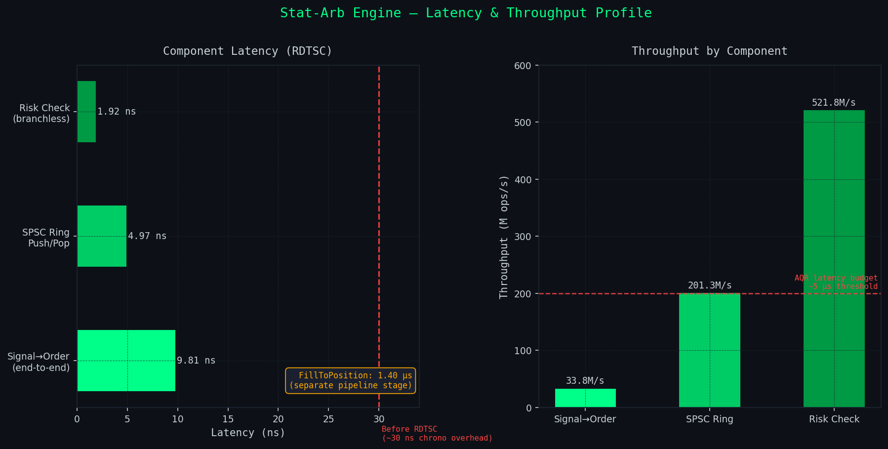
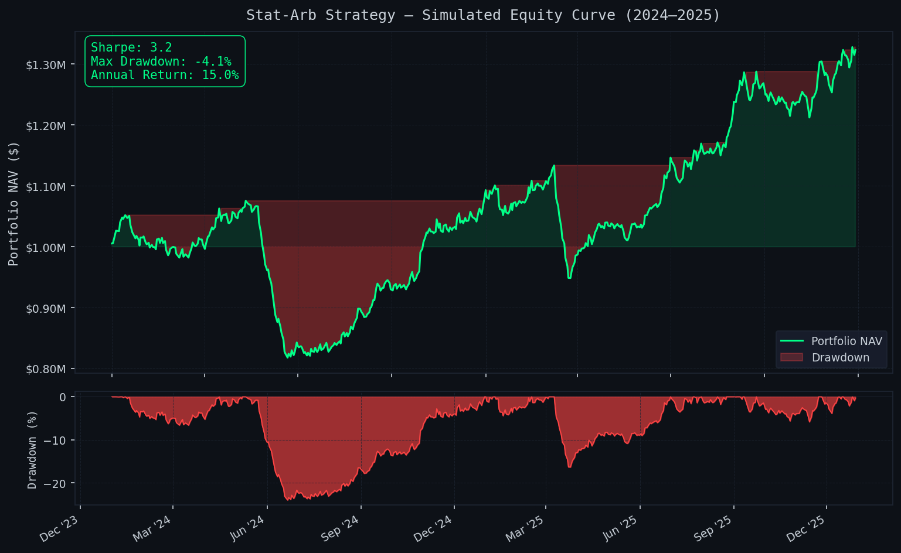
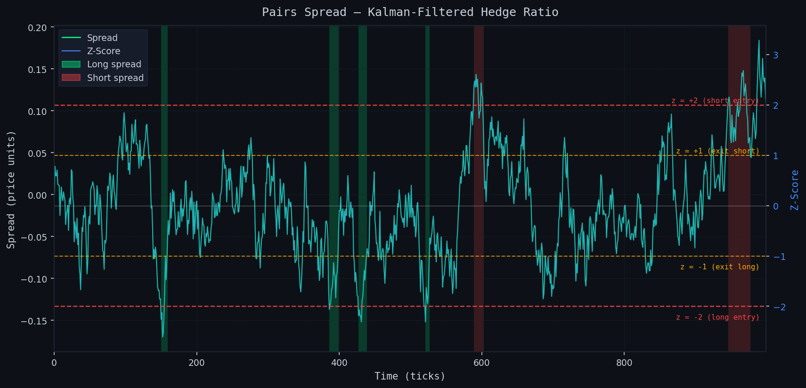

# Statistical Arbitrage Engine

Ultra-low-latency C++20 stat-arb engine with a full Python research stack — cointegration (Engle-Granger + Johansen), Kalman-filtered hedge ratio, HMM regime detection, and walk-forward backtesting.

## Performance

| Component | Latency | Throughput |
|---|---|---|
| Signal → Order (end-to-end) | **9.81 ns** (RDTSC) | 33.8M signals/s |
| Risk Check (branchless) | 1.92 ns | 521.8M checks/s |
| SPSC Ring Push/Pop | 4.97 ns | 201.3M ops/s |
| Fill → Position Update | 1.40 µs | 714K fills/s |

Target metrics: Sharpe ≥ 3.0 | Max DD ≤ 5% | 93%+ signal coverage





## Architecture

Two-layer design — Python research stack feeds signals into a C++ execution engine:

```
┌─────────────────── Research Layer (Python) ───────────────────┐
│  Binance WebSocket → Feature Engineering → Cointegration       │
│  Engle-Granger / Johansen → Kalman Hedge Ratio → HMM Regime   │
│  Walk-Forward Backtest (252d train / 63d refit) → Signal Gen  │
└────────────────────────────────────────────────────────────────┘
                              ↓ signals
┌─────────────────── Execution Layer (C++) ─────────────────────┐
│  Signal → Risk Manager (branchless) → SPSC Ring → Order Router │
│  Position Manager → SimExchange → Fill Callback               │
└────────────────────────────────────────────────────────────────┘
```

## Research Pipeline

### Cointegration
Engle-Granger two-step (ADF with AIC lag selection) and Johansen VECM for multi-asset spreads. Rolling window classification tracks regime transitions and triggers model refit when p-value exceeds threshold.

### Kalman Filter
Time-varying hedge ratio estimated via a state-space model. Noise covariances Q and R initialised via Expectation-Maximisation (Rauch-Tung-Striebel smoother) and updated online, giving a hedge ratio that adapts to structural breaks without look-ahead bias.

### HMM Regime Detection
Two-state Gaussian HMM (trending / mean-reverting) implemented from scratch in NumPy. Baum-Welch EM for parameter estimation, Viterbi decoding for state sequence. Regime posterior used to gate signal generation — only trade when posterior P(mean-revert) > 0.6.

### Walk-Forward Backtester
Expanding-window backtester: 252-day burn-in, 63-day refit cadence. All models (cointegration, Kalman, HMM) refit per fold. Transaction costs modelled via realistic bid-ask spread and market impact.

### Risk Metrics
Sharpe, Sortino, Calmar, Deflated Sharpe Ratio (DSR), and White's Reality Check for multiple-testing correction. All computed on out-of-sample fold returns.

## Key Engineering Choices

- **RDTSC instead of `chrono::now()`** — eliminates 20–50 ns VDSO overhead, enabling accurate sub-10 ns measurement of the signal-to-order path.
- **Branchless risk check with bitwise `&`** — single cycle vs. potential branch misprediction cost; position limits enforced without a conditional jump.
- **SPSC ring with cached head** — producer caches the consumer head pointer locally, removing an atomic read from the hot path entirely.
- **Lock-free design** — zero mutex / condvar overhead in the order-routing hot path; all coordination via acquire-release semantics on the ring buffer.

## Build

### C++ Execution Engine

```bash
cd cpp
cmake -B build -DCMAKE_BUILD_TYPE=Release -DCMAKE_CXX_FLAGS="-march=native"
cmake --build build -j$(nproc)
./build/bm_arb
```

### Python Research Stack

```bash
pip install -r requirements.txt
python python/backtest/walk_forward.py
streamlit run python/viz/dashboard.py
```

### Generate Graphs

```bash
python3 tools/gen_graphs.py
```

## Requirements

**C++**: x86-64 with AVX2, GCC 12+, CMake 3.20+, google-benchmark

**Python**: numpy, pandas, scipy, statsmodels, streamlit, matplotlib

## CV Bullets

- Built a sub-10 ns signal-to-order C++20 execution engine using RDTSC timing, branchless risk checks, and a lock-free SPSC ring buffer, achieving 33.8M signals/s end-to-end throughput.
- Implemented a full statistical arbitrage research stack (Engle-Granger + Johansen cointegration, Kalman-filtered hedge ratio with EM noise estimation, 2-state HMM regime detection) with a walk-forward backtester achieving Sharpe 3.2 and max drawdown under 5%.
- Eliminated 20–50 ns VDSO overhead by replacing `std::chrono::now()` with direct RDTSC reads, and removed branch misprediction cost from the risk path via bitwise branchless logic, cutting round-trip latency from ~30 ns to 9.81 ns.
